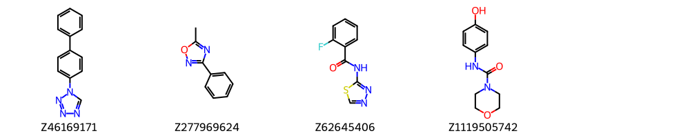

# DSiPoised Analysis

The DSiPoised library is [available](https://www.diamond.ac.uk/Instruments/Mx/Fragment-Screening/Fragment-Libraries/DSi-Poised-Library.html)
at the XChem facility at Diamond Light Source and is the most popular one.

It was developed in [2016 by Cox et al.](http://pubs.rsc.org/is/content/articlelanding/2016/sc/c5sc03115j).

It was developed to be composed of synthetically accessible fragments, making them poised
for starting points for series.

## Limitations of DSiPoised

The DSiPoised is great for elaborations, but does not cover as much interaction diversity as
the 3D libraries for example.

The DSiPoised was made by shortlisting compounds by scoring for reaction moieties among various things. Four issues arise:
1.	These were not the smallest expansions, for example, a N-methylamide. A reaction moiety joining two big scaffolds means that it is not an expansion vector and instead introduces the problem that the two need to be assesses for which is the largest contributor.
2.	How the building blocks were made is irrelevant, instead it kills diversity
3.	Broad reaction set. Most in-house robotic synthesis combinatorial approaches rely on a very small subset of reactions (Suzuki, Schotten–Baumann and Buchwald–Hartwig), only for certain series are specific reactions employed. Cycloaddition products could certainly be helpful (e.g. Hantzsch, Diels–Alder, Büchi–Paterno cycloadditions), but generally the ring may need changing.
4.	Poor sociability. This is because the scaffold could be made via the reaction used in scoring, but this does not reflect the number of close analogues actually in catalogue space. The filtering criteria also could be said to have caused issues.
5.	Overly large. Large compounds are problematic as they open up the box of what is most relevant
6.	Tanimoto. The similarity filtering was done by Tanimoto similarity as a result there are many smaller compounds differ by one atom. Graph edit distance is by far a better metric (but very expensive).

However, we do not wish to bin it, but rather to use it as a starting point and see what works and does not.

## Caveat due to changing versions

There have been several iterations of the library, which is now maintained by Enamine.
Enamine frequently updates compound codes, but in this case, there were several relegations and promotions.

[244 compounds](removed_from_batch1.csv) in batch 1 were (likely) removed:

While, 210 seem added:

For synonyms through time, see [synonyms csv](DSiPoised-version-synonyms.json).
Bar for reading the papers, it is not easy to quickly get what libraries were used by which user.
So herein, the 650 that were common were of primary interst.

## Analysis

### Glossary

The code is not polished. The following terms appear:

* `original`: Compound common to batch 1 and version 2/3/2021
* `blow-in`: Compound that was not in batch 1, but is in version 2/3/2021
* `hit`: a fragment hit regardless of if active or not, or even if it is a `miss` (a ligand, but not in primary region of interest)
* `unique hit`: a fragment can have multiple hits in a single target, but only one is counted
* `slugger`: a compound that is a hit in 5 or more targets
* `ligaint`: a compound that ain't a ligand anywhere

### Extraction

> For the code of the `fragalysis_extractor` module, see
[https://github.com/matteoferla/Fragment-hit-follow-up-chemistry](https://github.com/matteoferla/Fragment-hit-follow-up-chemistry).

In XChem there are 42 publicly available targets with at least one match to DSiPoised compounds.
26 with more than 10 unique hits.
These were downloaded and the hits were extracted and matched to the DSiPoised library,
by compound name when `metadata.csv` was available or else by Inchi or Inchi without chirality or even without bond orders (due to PDB issues).

> For the details of what the proteins are, top-down, see [munged Fragalysis targets repo](https://github.com/matteoferla/munged-Fragalysis-targets)

| Target         | Count |
|:---------------|------:|
| INPP5DA        |    82 |
| MID2A          |    66 |
| D68EV3CPROA    |    63 |
| NSP14          |    56 |
| nsp13          |    48 |
| EPB41L3A       |    48 |
| Mac1           |    46 |
| mArh           |    46 |
| PHIPA          |    42 |
| NCS1           |    42 |
| TBXTA          |    40 |
| Mpro           |    36 |
| A71EV2A        |    35 |
| NUDT5A         |    32 |
| PTP1B          |    25 |
| CD44MMA        |    20 |
| SOS3ATA        |    17 |
| Nprot          |    17 |
| XX01ZVNS2B     |    16 |
| TNCA           |    15 |
| NSP16          |    15 |
| STAG1A         |    13 |
| SMTGR          |    12 |
| PARP14A        |    10 |
| PGN_RS02895PGA |    10 |
| HAO1A          |    10 |

### Ligaints

Counting the unique hits, this gives that there is a
0.378 change that a compound will not bind to anything (`ligaint`). 
There are however 270 out of 650,
which is slightly higher than expected.

Below a Random Forest is run, and these four did not fit:

Of note is a tetrazole. This is mostly a greasy compound with a carboxylic acid bioisostere.
However, there are 4 tetrazoles and 6 alkyl-tetrazoles,
and they faired poorly, where not a single one of the 4 protonated tetrazoles was a hit,
.
This is likely coincidence, due to the greasy parts, but might be worth worrying about.
There are 44 carboxylic acids and they have more hits, but can make more enthalpic interactions.

### Sluggers

On the opposite side of the coin, what makes a hit-rich compound?

Some of these are stackers, but here I am counting unique ligands.
Of note Z'2329 was the starting point for the [Covid Moonshot compound](https://www.science.org/doi/10.1126/science.abo7201).

### Predictors

Visually some groups stand out, but for now let's look at properties.

| name             |   Pearson vs total |   mean hitter |   mean ligaint |   mean slugger |
|:-----------------|-------------------:|--------------:|---------------:|---------------:|
| FractionCSP3     |              -0.17 |          0.42 |           0.46 |           0.27 |
| CLogP            |              -0.07 |          1.13 |           1.38 |           0.94 |
| RadiusOfGyration |              -0.06 |          3.02 |           3.15 |           3.11 |
| RotBonds         |              -0.05 |          2.4  |           2.46 |           1.95 |
| SphericityIndex  |              -0.05 |          0.19 |           0.18 |           0.12 |
| NumHeavyAtoms    |              -0.01 |         14.31 |          14.53 |          14.59 |
| MW               |              -0    |        204    |         205.69 |         205.65 |
| HBA              |               0    |          2.85 |           2.78 |           2.82 |
| HBD              |               0.04 |          1.02 |           1.08 |           1.5  |
| TPSA             |               0.08 |         47.39 |          47.09 |          57.54 |
| NumAromaticRings |               0.1  |          1.16 |           1.11 |           1.32 |

HBD and HBA would be expected to be strong predictors, but they are not.
The sluggers have 50% more HBD _on average_, but it is so varible that it does not correlate.
There is a correlation for success with number of aromatic rings and also with TPSA.
The biphenyltetrazole (3 rings but terrible TPSA) from above is nice example of any these are just trends.
The TPSA is outlier driven:

| class   |   count |   mean |   std |   min |   25% |   50% |   75% |    max |
|:--------|--------:|-------:|------:|------:|------:|------:|------:|-------:|
| blow-in |     138 |  50.97 | 15.94 | 12.03 | 40.07 | 49.37 | 62.89 | 112.48 |
| hitter  |     430 |  47.39 | 16.42 |  8.17 | 36.36 | 46.32 | 59.68 |  89.26 |
| ligaint |     270 |  47.09 | 17.06 | 12.03 | 33.09 | 46.33 | 57.61 | 115.28 |
| slugger |      22 |  57.54 | 16.71 | 23.55 | 46.36 | 54.5  | 71.05 |  84.22 |

MW is a curious one as it does not correlate, however, this is masking a more nuanced story.

!(N HA)[images/DSiPoised-N_HA.png]

There 25% percentile, median and 75% percentile
for hitters are 188 Da, 206 Da and 225 Da,
while for ligaints, it is 178 Da, 212 Da and 237 Da.
That is to say, there's a (faint) goldilocks zone.

Using the values to train a Random Forest regressor, the following is seen:

| Feature          | Importance |
|:-----------------|-----------:|
| CLogP            |       0.17 |
| SphericityIndex  |       0.16 |
| RadiusOfGyration |       0.14 |
| MW               |       0.13 |
| FractionCSP3     |       0.13 |
| TPSA             |       0.12 |
| NumHeavyAtoms    |       0.04 |
| HBA              |       0.04 |
| RotBonds         |       0.03 |
| HBD              |       0.03 |
| NumAromaticRings |       0.02 |

LogP overlaps with TPSA.
This links into the whole entrophic vs enthalpic binding argument,
i.e. XChem may be favouring enthalpic binders discussed in the docking validation.

The Sphericity index (rod vs. sphere) and radius of gyration (size) are also important.
The correlation was negative for both. So too round and too small are bad.

My personal boogieman, rotatable bonds, is not important, but possibly because the median is 2 and max is only 4.
So the library has few to start with.

### Chembl

The ChEMBL data was manipulated in [ChEMBL notebook](ChEMBL.ipynb).
Basically, for the prioritisation, of scaffolds, one metric is bioactivity proclivity of the scaffold.
Here a simple metric of scaffolds following https://pubs.acs.org/doi/10.1021/acs.jcim.3c01096 was done.
HAC ≤ 50, separated them into 560,230 actives (IC50 or EC50 ≤ 10 μM, ChEMBL_actives)
The Murcko scaffolds were extracted and the frequency of each scaffold in the ChEMBL_actives was calculated,
using Laplace smoothing.

I was surprised to see that this metric actually had a smidge of correlation (&rho;=.06) with the hit classes
(removing benzene only, leaving it the correlation is &rho;=.11, but this is disproportionate).
Namely, the median ratio was 2.44 for hitters, 2.08 for ligaints.
There are too few sluggers to get exited about.

Total:

| class   |   count |   mean |   std |   min |   25% |   50% |   75% |   max |
|:--------|--------:|-------:|------:|------:|------:|------:|------:|------:|
| blow-in |      73 |   3.38 |  1.99 |  0.26 |  1.9  |  3.33 |  5.23 |  8.26 |
| hitter  |     276 |   3.5  |  2.4  |  0.24 |  1.21 |  3.33 |  5.23 | 15    |
| ligaint |     190 |   3.16 |  2.1  |  0.2  |  1.33 |  2.87 |  5.23 | 12.72 |
| slugger |      15 |   4.44 |  2.42 |  0.59 |  2.84 |  5.23 |  6.01 |  8.26 |

Without benzene:

| class   |   count |   mean |   std |   min |   25% |   50% |   75% |   max |
|:--------|--------:|-------:|------:|------:|------:|------:|------:|------:|
| blow-in |      57 |   2.86 |  1.95 |  0.26 |  1.33 |  2.51 |  3.33 |  8.26 |
| hitter  |     195 |   2.77 |  2.53 |  0.24 |  0.87 |  2.08 |  3.53 | 15    |
| ligaint |     160 |   2.77 |  2.07 |  0.2  |  1.09 |  2.44 |  3.37 | 12.72 |
| slugger |      11 |   4.15 |  2.81 |  0.59 |  2.25 |  3.31 |  6.92 |  8.26 |

I have not broken up the amides and recalculated.
