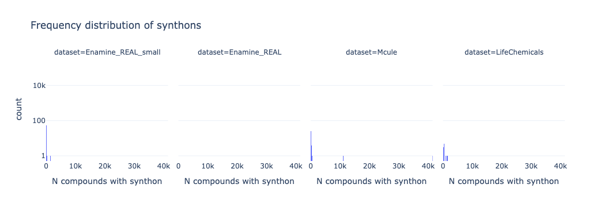
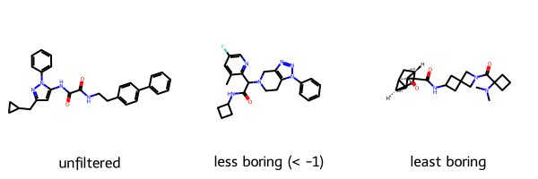

> This was in readme but removed due to obsolescence

Vendor catalogue space is too big for the in-house database.
There are two ways to subset the vendor catalogue space:

* **Projection**. Decompose and enumerate analogues of the compounds in the libraries, 
    and subset all catalogue compounds that include them
* **Trim**. Subset the catalogues by a set of rules, including
    a metric that approximates how 'amicable' the compounds are to each other and accessible
    to a restricted reaction repertoire.

Due to the urgency, the latter has to be done.

> NB. The first version was not good ([selection_v1.py](depracated/library_subsetting/selection_v1.py)), so see version 2 ([selection_v2.py](depracated/library_subsetting/selection_v2.py)).
> These rely on [library_classification.py](depracated/library_subsetting/library_classification.py) and [library_classification_torch.py](depracated/library_subsetting/library_classification_torch.py), where the latter inherits the former.

This requires the following steps:

* **Decomposition**. Decompose the compounds into synthons that can be combined via the robot's restricted reaction repertoire,
* **Amicability**. Assign a metric that approximates how 'amicable' the compounds are

The first is done by the class `RoboDecomposer` (declared in the constructor method).
The reactions had to be written from scratch to avoid problems with lactams and sulfams
(i.e. whereas intramolecular reactions are fine, decomposing them as separate molecules is not, 
for example penicillin G (lactam) and meloxicam (sulfams) are safe, biotin and saccharin twice as so as ureido is okay).
Usage: `synthons = RoboDecomposer.decompose(mol)`. See code for reaction patterns.

This reverses the following bonds:

* _Amides_: fully exocyclic, or exocyclic carbonyls with alicylic or aromatic nitrogen, secondary or tertiary amides,
    avoids ureido (cf. isocyanate ureidation) and lactam.
    This results in aryl-chloride and amine.
    For simplicity this lumps together a few reaction
    (EDC amidation -> primary amines only,
    HATU amidation -> primary, secondary amines and aromatic aza (TBC),
    Schotten-Baumann reaction -> arylhalide not carboxylic acid,
    Buckwald-Hartwig amination -> inc. aromatic aza).
* _Sulfonamides_: fully exocyclic, or exocyclic carbonyls, secondary or tertiary sulfonamides.
    Avoids sulfams.
    This results in sulfonyl chloride and amine. This is sulfo Schotten-Baumann reaction product.
* _Biaryls_: two arenes connected by a single bond.
    This results in two aryl halides (for simplicity: one would be a boronic acid/ester).
    This is the Suzuki–Miyaura reaction product.

A few other 'backwards' reactions were written for test purposes but not enabled as I do not believe the robot can do them.
Williamson (ether/thioether, flag: ether, but does both ether and thioether), 
Ureidation (flag: urea),
Chan-Lam (flag: arylamine),
Sonogashira (alkyne flag),
Huisgen (triazole flag),
Borch (amine flag).
Ugi, Buchwald-Hartwig etc. were not written but have been mentioned in the past.
A big caveat is that in reality the compounds are based on the building blocks and
not all possible versions are possible,
for example Schotten-Baumann reaction vs EDC amidation require different building blocks (aryl-halide vs caboxylic acid),
or ureidation requires one synthon to have an isocyanate and the other an amine,
which is indistinguishable if neither nitrogen is tertiary.

Additionally, for simplicity, all halogens are collapsed into chloride.
Whereas they have different properties, they are a good way to reduce unneeded diversity.
As a results the distribution of synthons heavy atom count is positively skewed.

### First pass synthon amicabilty
In a first pass, random slices of 100k the Enamine REAL database were used.
For each synthon, the sum of dataset-counts of each synthons within USRCAT 0.7.
For a compound the synthon amicability is the sum of the amicabilities tally for each synthon.

However, the synthon amicability score is higher for smaller synthons.

Then the 'synthon amicability' is calculated.
Due to time constraints and because I was instructed to use USRCAT,
I used USRCAT as a pharmacophoric similarity metric.
There is an issue in that USRCAT is fast as positions the molecules relative to its moments of itertia,
and uses the positions of the pharmacophores to make a vector, that can be used to calcuate the USRCATScore,
without having to superimpose the molecules (`Open3D`) which would be a combinatorial problem.
This is unsuitable for fragments/synthons, as the PMIs are easily shifted,
whereas methods that use the internal distances between pharmacophores, may be more suitable  (see section).

The cutoff of 0.7 was chosen because it is traditional in USRCAT, but also is in the tail range of the distribution of USRCAT scores.

This synthon illuestrates the issue with USRCAT:

To make the analysis easier, random slices of 100k the Enamine REAL database were used,
and compared to another.

In the first pass, amidation hydrolysis was resulting in a carboxylic acid, this was changed to an arylchloride,
to make it less of a common pharmacophore —even if chloride is a hydrophobe type.
The most amicable synthons are [here](images/most_amicable_synthons.png).
This shows a problem that these operate as a group (i.e. top place is shared between a bunch of fragments) and 
the presence of a synthon once can make it to the top ranking. 
Whereas there is an 88% Pearson &rho;, the Jaccard index is 0.61 for the top quartile.

The issue is that uncommon synthons can be highly amicable with common synthons,
making the list of amicable synthons very long/variable.
A solution would be not to make a perfect list of precomputed synthon amicability tallies,
but to calculate the amicability partially on the fly, using a small reference set of synthons.

As the most common synthons lack rings. It should be enforced that they have at least a ring.

For 1M subset, there are ~60k synthons. ~30% are singletons. 7% are doublets. 1% appear 5+ times.
1k is a nice number and is 10+ times with rings in the 1M subset.

### Second pass synthon sociability

With a Cuda implementation of USRScore it takes ~0.6 ms to get the USRCATScores for 1k synthons.
Consequently, the most common synthons in give subsets were found and used as a reference set.
One issue is that the datasets have different powerlaw like distributions.

Summary of the distribution of the number of compounds that are 0.7 USRCAT Score distance to a synthon
from a 1M randomly drawn subset (or full 0.5M for LC):

| dataset            |   count |   mean |   std |   min |   25% |   50% |   75% |   max |   ≥10 |          α |
|:-------------------|--------:|-------:|------:|------:|------:|------:|------:|------:|------:|-----------:|
| Enamine_REAL       |   60193 |      1 |     3 |     1 |     1 |     1 |     2 |   288 |  1092 |     0.0020 |
| Enamine_REAL_small |   58871 |     19 |    53 |     2 |     4 |     8 |    19 |  4250 | 27053 |     0.0016 |
| Mcule              |  230167 |      5 |   141 |     1 |     1 |     1 |     1 | 41466 |  8957 |     0.0014 |
| LifeChemicals      |  142480 |      7 |   114 |     1 |     1 |     1 |     1 | 22057 |  6990 |     0.0014 |

LC was added as it represents a vendor that specialises in funky building-blocks,
making it a good reference for what MCule has than Enamine lacks. 

For all datasets the most common synthons are the same (benzene derivatives).
Enamine REAL has a broader reaction repertoire than the one in the decomposing algorithm
but has a smaller stock of building blocks than say MCule. As a result the powerlaw is 'wonky'.
The 1k synthons with 10+ derivatives in a 1 M subset, will have 63k+ derivatives in the full 6B Enamine REAL.
The subset of the Enamine REAL database in the HAC 11-21 range (666M) is curious as it profoundly different than the full dataset.

The dataset `common_synthons_SpikeIn.pkl.gz` contains 7,975 synthons (as Inchi to tally and USRCAT vector).
These are synthons with 10+ 0.7 USRCAT Score distance compounds in the Enamine random subset,
100+ in the Enamine REAL small subset, 120+ in the LifeChemicals subset,
and 30+ in the Mcule subset. The 'tally' is a number normalised to the Enamine REAL subset.

For a visual of a random subset of these see: [subset-of-common-synthons.png](images/subset-of-common-synthons.png)
(Values are normalised: MCule tally of 10 is actually 30, hence the 0 counts)

Synthons and whole compounds from the XChem libraries were spiked into the dataset,
with an artificial weight of 100 to ensure compounds that were sociable with them prevailed.
7975 synthons were used.

For weights used see [properties-vs-HAC.md](properties-vs-HAC.md).

### Boringness index
One issue is that the most sociable compounds are the most boring, causing a rise in benzenes. 

To counter this, a filter was added that the compound must have a negative 'boringness' score,
defined as:

* +1 for each aromatic carbocycle
* +1/4 for each methylene group
* -1 for each bridged, spiro, fused and/or alicylic ring (stacks)
* -1/2 for each heterocycle

The PMI are not factor in even if rod-like compounds dominate Enamine REAL,
this is because the subset of Enamine+ MCule will be used by the FragmentKnitwork algorithm,
so will do only two-way fragment mergers.

## Third pass

The synthetic sociability was premised that the end user was using USRCAT,
this was a miscommunication. Instead, Pharm2D was used due to speed, with a Tversky similarity with weights 0.7 and 0.3.
The assymetric score is great as I was worried that novel pharmacophoric pairing would be lost,
however, the ever-changing settings is problematic. As a result, I should drop the sociability request,
and instead maximise diversity.
The restrictive reaction repertoire is a problem as it is not clear what is possible and causes a self-fullfilling prophecy,
where only amidation is done.
Therefore, the breath of reactions is expanded. However, the robot will be doing late stage functionalisations,
primarily for coupling reactions. As discussed, blindly applying a set of ~200 curated SMARTS, is bad,
as that is not how retrosynthesis works, and most reactions are not applicable late stage.
However, there is no harm in getting inspirations that way!
This is the frequency of the LSF coupling groups in a subset of the Enamine REAL database, using bespoke SMARTS.

| group                | Frequency |
|:---------------------|----------:|
| alkyne               |       127 |
| sulfonamide          |      25.5 |
| biaryl               |      23.1 |
| cycloaddition        |      18.4 |
| ureido               |      11.4 |
| alkene               |      10.1 |
| pyrrolic_substituted |       4.2 |
| ether                |       2.5 |
| alkylarene           |         2 |
| higher-amine         |       1.7 |
| amide                |         1 |