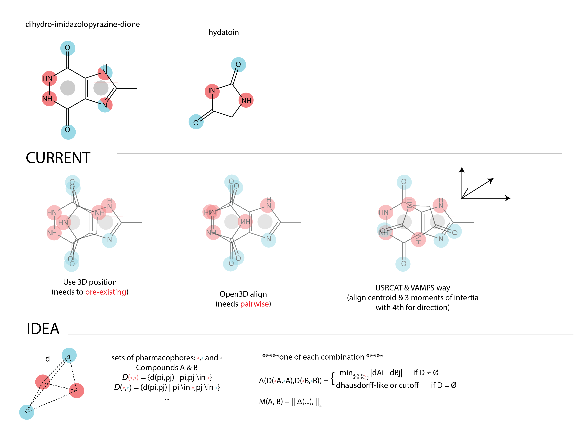

## Ideal

## USRCAT test
USRCAT is fast as positions the molecule relative to its moments of itertia,
and uses the positions of the pharmacophores to make a vector, that can be used to calcuate the USRCATScore,
without having to superimpose the molecules (`Open3D`) which is a combinatorial problem.

This has the problem that the vectors of the moments of inertial in a scaffold can change quickly.

To illustrate the problem illustrative scaffolds were used:

Namely:

* imidazo-dihydropyrazine-dione
* hydrantoin
* pyridone
* quinoline
* tropane

To which the following groups are added:

* hydro
* methyl
* cyclopropyl
* dicyclopropyl-isopropyl
* cyclohexane
* amide

In none of the scaffolds the USRCAT is above 0.7 with the addition of methyl group.

This holds true going from R=cyclohexane:

Tanimoto similarity (Morgan FPs) is known to be problematic for fragments
and in this case, where the compounds are very symmetrical, it is more so.
This means that caution must be used with fragments.

## Ligity (PIP)

An interesting variant come from using distances between pharmacophores.
In Pharm2D the distance is number of bonds (i.e. is structure based), while in Ligity it is a 3D distance.
In this scenario a cube is made of 3-way binned distances.
This has the issue that the similarity is effective binary with fragments,
and amide greatly increases the similarity.

However, it is a very good starting point with two tweaks greatly increasing the granularity.

smoothed and angles

bla bla

