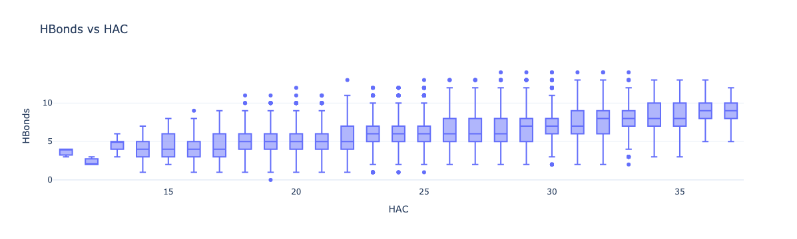
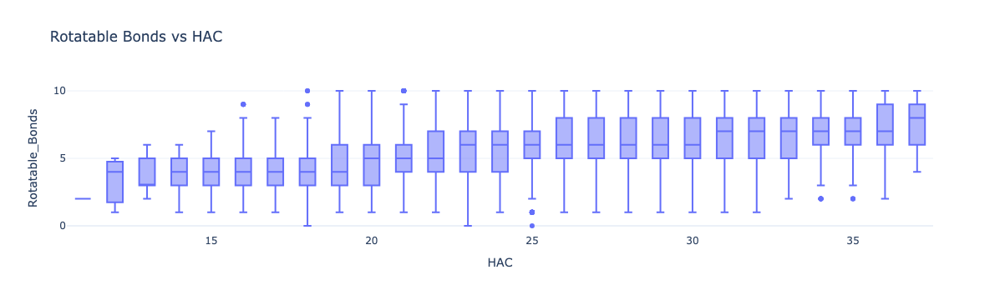
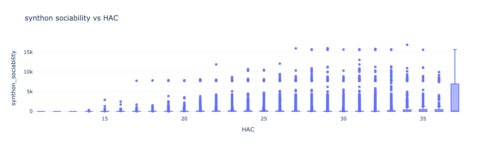
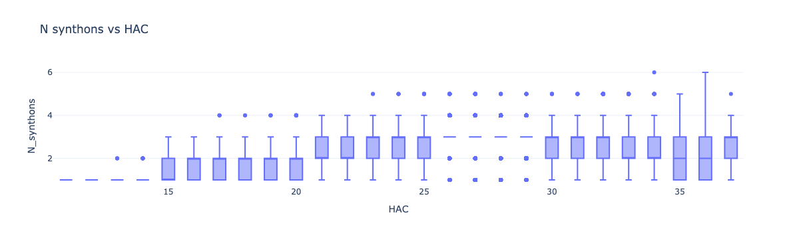
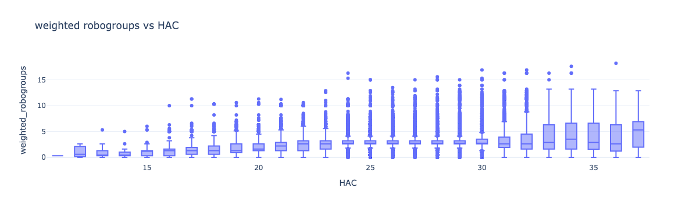
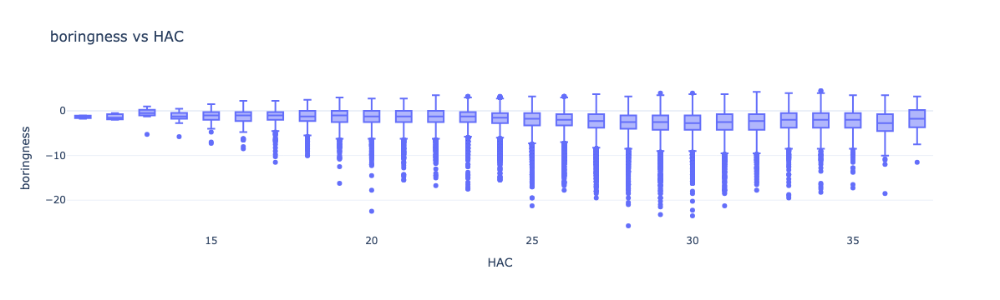

## Heavy atom count

There are several properties that I want to be optimal,
but they, to some extent, depend on the size of the molecule.

As of the 15/08/24 the cutoffs used were to remove the bottom quartile of each property.

* **min_hbonds_per_HAC** = 1 / 5
* **max_rota_per_HAC** = 1 / 5 
* **min_synthon_sociability_per_HAC** = 0.354839
* **min_weighted_robogroups_per_HAC** = 0.0838
* **max_boringness** = 0

Boringness of zero is scale invariant so no need for HAC correction.

Unfortunately, `max_rota_per_HAC` of 1/5 removes 75% of the molecules, not 25%.

